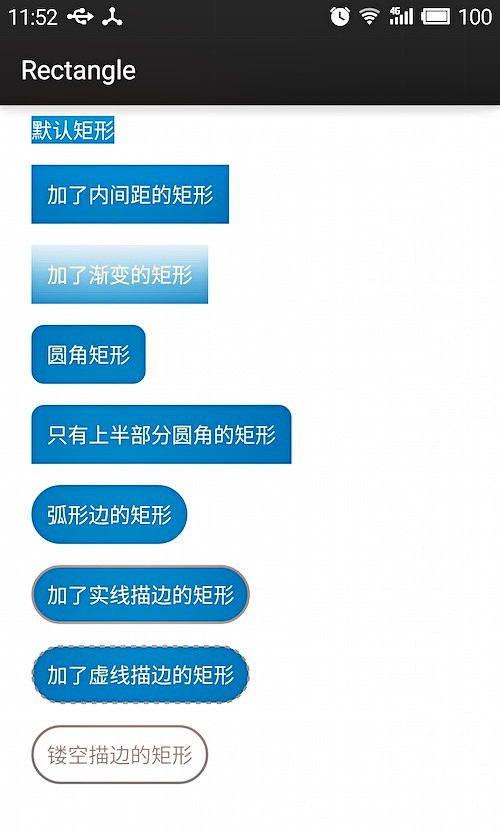
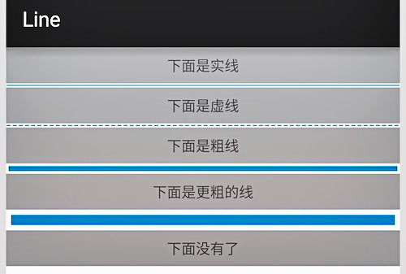

欢迎使用 **{小书匠}(xiaoshujiang)编辑器**，您可以通过==设置==里的修改模板来改变新建文章的内容。
----------------------------------------------------------------

## shape篇

一个应用，应该保持一套统一的样式，包括Button、EditText、ProgressBar、Toast、Checkbox等各种控件的样式，还包括控件间隔、文字大小和颜色、阴影等等。web的样式用css来定义，而android的样式主要则是通过shape、selector、layer-list、level-list、style、theme等组合实现。我将用一系列文章，循序渐进地讲解样式的每个方面该如何实现。第一个要讲的就是shape，最基础的形状定义工具。

一般用shape定义的xml文件存放在drawable目录下，若项目没有该目录则新建一个，而不要将它放到drawable-hdpi等目录中。

使用shape可以自定义形状，可以定义下面四种类型的形状，通过android:shape属性指定：

rectangle: 矩形，默认的形状，可以画出直角矩形、圆角矩形、弧形等
oval: 椭圆形，用得比较多的是画正圆
line: 线形，可以画实线和虚线
ring: 环形，可以画环形进度条

## rectangle

rectangle是默认的形状，也是用得最多的形状，一些文字背景、按钮背景、控件或布局背景等，以下是一些简单的例子：
实现上面的那些效果，都用到了以下这些特性：



solid: 设置形状填充的颜色，只有android:color一个属性

android:color 填充的颜色
padding: 设置内容与形状边界的内间距，可分别设置左右上下的距离

android:left 左内间距
android:right 右内间距
android:top 上内间距
android:bottom 下内间距
gradient: 设置形状的渐变颜色，可以是线性渐变、辐射渐变、扫描性渐变

android:type 渐变的类型
linear 线性渐变，默认的渐变类型
radial 放射渐变，设置该项时，android:gradientRadius也必须设置
sweep 扫描性渐变
android:startColor 渐变开始的颜色
android:endColor 渐变结束的颜色
android:centerColor 渐变中间的颜色
android:angle 渐变的角度，线性渐变时才有效，必须是45的倍数，0表示从左到右，90表示从下到上
android:centerX 渐变中心的相对X坐标，放射渐变时才有效，在0.0到1.0之间，默认为0.5，表示在正中间
android:centerY 渐变中心的相对X坐标，放射渐变时才有效，在0.0到1.0之间，默认为0.5，表示在正中间
android:gradientRadius 渐变的半径，只有渐变类型为radial时才使用
android:useLevel 如果为true，则可在LevelListDrawable中使用
corners: 设置圆角，只适用于rectangle类型，可分别设置四个角不同半径的圆角，当设置的圆角半径很大时，比如200dp，就可变成弧形边了

android:radius 圆角半径，会被下面每个特定的圆角属性重写
android:topLeftRadius 左上角的半径
android:topRightRadius 右上角的半径
android:bottomLeftRadius 左下角的半径
android:bottomRightRadius 右下角的半径
stroke: 设置描边，可描成实线或虚线。

android:color 描边的颜色
android:width 描边的宽度
android:dashWidth 设置虚线时的横线长度
android:dashGap 设置虚线时的横线之间的距离
接下来说下实际怎么使用。以下是加了虚线描边的矩形的代码，文件命名为bg_rectangle_with_stroke_dash.xml，放在drawable目录下：
``` java
<?xml version="1.0" encoding="utf-8"?>
<!-- android:shape指定形状类型，默认为rectangle -->
<shape xmlns:android="http://schemas.android.com/apk/res/android"
    android:shape="rectangle">
    <!-- solid指定形状的填充色，只有android:color一个属性 -->
    <solid android:color="#2F90BD" />
    <!-- padding设置内容区域离边界的间距 -->
    <padding
        android:bottom="12dp"
        android:left="12dp"
        android:right="12dp"
        android:top="12dp" />
    <!-- corners设置圆角，只适用于rectangle -->
    <corners android:radius="200dp" />
    <!-- stroke设置描边 -->
    <stroke
        android:width="2dp"
        android:color="@android:color/darker_gray"
        android:dashGap="4dp"
        android:dashWidth="4dp" />
</shape>
```
接着在要使用的view里引用就可以了，例如本例中用做TextView的background：
``` java
<TextView
    android:layout_width="wrap_content"
    android:layout_height="wrap_content"
    android:layout_margin="8dp"
    android:text="加了虚线描边的矩形"
    android:textSize="16sp"
    android:textColor="@android:color/white"
    android:background="@drawable/bg_rectangle_with_stroke_dash" />

```
## oval

oval用来画椭圆，而在实际应用中，更多是画正圆，比如消息提示，圆形按钮等，下图是一些例子：

上面的效果图应用了solid、padding、stroke、gradient、size几个特性。size是用来设置形状大小的，如下：

size: 设置形状默认的大小，可设置宽度和高度
android:width 宽度
android:height 高度
数字0是默认的椭圆，只加了solid填充颜色，数字1则加了上下左右4dp的padding，后面的数字都是正圆，是通过设置size的同样大小的宽高实现的，也可以通过设置控件的宽高一致大小来实现。数字3加了描边，数字4是镂空描边，数字5是虚线描边，数字6用了radial渐变。注意，使用radial渐变时，必须指定渐变的半径，即android:gradientRadius属性。

以下是渐变的代码实现，文件为bg_oval_with_gradient.xml：
``` java
<?xml version="1.0" encoding="utf-8"?>
<!-- android:shape指定形状类型，默认为rectangle -->
<shape xmlns:android="http://schemas.android.com/apk/res/android"
    android:shape="oval">
    <!-- padding设置内间距 -->
    <padding
        android:bottom="4dp"
        android:left="4dp"
        android:right="4dp"
        android:top="4dp" />
    <!-- size设置形状的大小 -->
    <size
        android:width="40dp"
        android:height="40dp" />
    <!-- gradient设置渐变 -->
    <gradient
        android:endColor="#000000"
        android:gradientRadius="40dp"
        android:startColor="#FFFFFF"
        android:type="radial" />
</shape>
```

引用的代码：
``` java
<TextView
    android:layout_width="wrap_content"
    android:layout_height="wrap_content"
    android:gravity="center"
    android:layout_margin="8dp"
    android:text="6"
    android:textSize="20sp"
    android:textColor="@android:color/black"
    android:background="@drawable/bg_oval_with_gradient" />
```
## line

line主要用于画分割线，是通过stroke和size特性组合来实现的，先看虚线的代码：
``` java
<?xml version="1.0" encoding="utf-8"?>
<shape xmlns:android="http://schemas.android.com/apk/res/android"
    android:shape="line">
    <!-- 实际显示的线 -->
    <stroke
        android:width="1dp"
        android:color="#2F90BD"
        android:dashGap="2dp"
        android:dashWidth="4dp" />
    <!-- 形状的高度 -->
    <size android:height="4dp" />
</shape>
```
画线时，有几点特性必须要知道的：

只能画水平线，画不了竖线；
线的高度是通过stroke的android:width属性设置的；
size的android:height属性定义的是整个形状区域的高度；
size的height必须大于stroke的width，否则，线无法显示；
线在整个形状区域中是居中显示的；
线左右两边会留有空白间距，线越粗，空白越大；
引用虚线的view需要添加属性android:layerType，值设为"software"，否则显示不了虚线。

## ring
首先，shape根元素有些属性只适用于ring类型，先过目下这些属性吧：

android:innerRadius 内环的半径
android:innerRadiusRatio 浮点型，以环的宽度比率来表示内环的半径，默认为3，表示内环半径为环的宽度除以3，该值会被android:innerRadius覆盖
android:thickness 环的厚度
android:thicknessRatio 浮点型，以环的宽度比率来表示环的厚度，默认为9，表示环的厚度为环的宽度除以9，该值会被android:thickness覆盖
android:useLevel 一般为false，否则可能环形无法显示，只有作为LevelListDrawable使用时才设为true

第一个图只添加了solid；第二个图只添加了gradient，类型为sweep；第三个图只添加了stroke；第四个图添加了gradient和stroke两项特性。
以下为第四个图的代码：


``` java
<?xml version="1.0" encoding="utf-8"?>
<shape xmlns:android="http://schemas.android.com/apk/res/android"
    android:innerRadiusRatio="3"
    android:shape="ring"
    android:thicknessRatio="9"
    android:useLevel="false">
    <gradient
        android:endColor="#2F90BD"
        android:startColor="#FFFFFF"
        android:type="sweep" />
    <stroke
        android:width="1dp"
        android:color="@android:color/black" />
</shape>
```
如果想让这个环形旋转起来，变成可用的进度条，则只要在shape外层包多一个rotate元素就可以了。

``` java
<?xml version="1.0" encoding="utf-8"?>
<rotate xmlns:android="http://schemas.android.com/apk/res/android"
    android:fromDegrees="0"
    android:pivotX="50%"
    android:pivotY="50%"
    android:toDegrees="1080.0">
    <shape
        android:innerRadiusRatio="3"
        android:shape="ring"
        android:thicknessRatio="8"
        android:useLevel="false">
        <gradient
            android:endColor="#2F90BD"
            android:startColor="#FFFFFF"
            android:type="sweep" />
    </shape>
</rotate>
```

----------------------------------------------------------------------------------------------

## selector篇

上一篇详细讲了shape的用法，讲解了怎么用shape自定义矩形、圆形、线形和环形，以及有哪些需要注意的地方。不过，shape只能定义单一的形状，而实际应用中，很多地方比如按钮、Tab、ListItem等都是不同状态有不同的展示形状。举个例子，一个按钮的背景，默认时是一个形状，按下时是一个形状，不可操作时又是另一个形状。有时候，不同状态下改变的不只是背景、图片等，文字颜色也会相应改变。而要处理这些不同状态下展示什么的问题，就要用selector来实现了。

selector标签，可以添加一个或多个item子标签，而相应的状态是在item标签中定义的。定义的xml文件可以作为两种资源使用：drawable和color。作为drawable资源使用时，一般和shape一样放于drawable目录下，item必须指定android:drawable属性；作为color资源使用时，则放于color目录下，item必须指定android:color属性。

那么，看看都有哪些状态可以设置呢：

android:state_enabled: 设置触摸或点击事件是否可用状态，一般只在false时设置该属性，表示不可用状态
android:state_pressed: 设置是否按压状态，一般在true时设置该属性，表示已按压状态，默认为false
android:state_selected: 设置是否选中状态，true表示已选中，false表示未选中
android:state_checked: 设置是否勾选状态，主要用于CheckBox和RadioButton，true表示已被勾选，false表示未被勾选
android:state_checkable: 设置勾选是否可用状态，类似state_enabled，只是state_enabled会影响触摸或点击事件，而state_checkable影响勾选事件
android:state_focused: 设置是否获得焦点状态，true表示获得焦点，默认为false，表示未获得焦点
android:state_window_focused: 设置当前窗口是否获得焦点状态，true表示获得焦点，false表示未获得焦点，例如拉下通知栏或弹出对话框时，当前界面就会失去焦点；另外，ListView的ListItem获得焦点时也会触发true状态，可以理解为当前窗口就是ListItem本身
android:state_activated: 设置是否被激活状态，true表示被激活，false表示未激活，API Level 11及以上才支持，可通过代码调用控件的setActivated(boolean)方法设置是否激活该控件
android:state_hovered: 设置是否鼠标在上面滑动的状态，true表示鼠标在上面滑动，默认为false，API Level 14及以上才支持
接下来，看看示例代码，以下是bg_btn_selector.xml的代码，用于按钮的背景：
``` xml
<?xml version="1.0" encoding="utf-8"?>
<selector xmlns:android="http://schemas.android.com/apk/res/android">
    <!-- 当前窗口失去焦点时 -->
    <item android:drawable="@drawable/bg_btn_lost_window_focused" android:state_window_focused="false" />
    <!-- 不可用时 -->
    <item android:drawable="@drawable/bg_btn_disable" android:state_enabled="false" />
    <!-- 按压时 -->
    <item android:drawable="@drawable/bg_btn_pressed" android:state_pressed="true" />
    <!-- 被选中时 -->
    <item android:drawable="@drawable/bg_btn_selected" android:state_selected="true" />
    <!-- 被激活时 -->
    <item android:drawable="@drawable/bg_btn_activated" android:state_activated="true" />
    <!-- 默认时 -->
    <item android:drawable="@drawable/bg_btn_normal" />
</selector>
```
而下面则是text_btn_selector.xml的代码，用于按钮的文本颜色：
``` xml
<?xml version="1.0" encoding="utf-8"?>
<selector xmlns:android="http://schemas.android.com/apk/res/android">
    <!-- 当前窗口失去焦点时 -->
    <item android:color="@android:color/black" android:state_window_focused="false" />
    <!-- 不可用时 -->
    <item android:color="@android:color/background_light" android:state_enabled="false" />
    <!-- 按压时 -->
    <item android:color="@android:color/holo_blue_light" android:state_pressed="true" />
    <!-- 被选中时 -->
    <item android:color="@android:color/holo_green_dark" android:state_selected="true" />
    <!-- 被激活时 -->
    <item android:color="@android:color/holo_green_light" android:state_activated="true" />
    <!-- 默认时 -->
    <item android:color="@android:color/white" />
</selector>
```
最后，则是在控件中的引用：

``` xml
<Button 
    android:id="@+id/btn_default"
    android:layout_width="match_parent"
    android:layout_height="wrap_content"
    android:layout_margin="8dp"
    android:background="@drawable/bg_btn_selector"
    android:text="默认按钮"
    android:textColor="@color/text_btn_selector" />
```
那么，在使用过程中，有几点还是需要注意和了解的：

selector作为drawable资源时，item指定android:drawable属性，并放于drawable目录下；
selector作为color资源时，item指定android:color属性，并放于color目录下；
color资源也可以放于drawable目录，引用时则用@drawable来引用，但不推荐这么做，drawable资源和color资源最好还是分开；
android:drawable属性除了引用@drawable资源，也可以引用@color颜色值；但android:color只能引用@color；
item是从上往下匹配的，如果匹配到一个item那它就将采用这个item，而不是采用最佳匹配的规则；所以设置默认的状态，一定要写在最后，如果写在前面，则后面所有的item都不会起作用了。
另外，selector标签下有两个比较有用的属性要说一下，添加了下面两个属性之后，则会在状态改变时出现淡入淡出效果，但必须在API Level 11及以上才支持：

android:enterFadeDuration 状态改变时，新状态展示时的淡入时间，以毫秒为单位
android:exitFadeDuration 状态改变时，旧状态消失时的淡出时间，以毫秒为单位
最后，关于ListView的ListItem样式，有两种设置方式，一种是在ListView标签里设置android:listSelector属性，另一种是在ListItem的布局layout里设置android:background。但是，这两种设置的结果却有着不同。同时，使用ListView时也有些其他需要注意的地方，总结如下：

android:listSelector设置的ListItem默认背景是透明的，不管你在selector里怎么设置都无法改变它的背景。所以，如果想改ListItem的默认背景，只能通过第二种方式，在ListItem的布局layout里设置android:background。
当触摸点击ListItem时，第一种设置方式下，state_pressed、state_focused和state_window_focused设为true时都会触发，而第二种设置方式下，只有state_pressed会触发。
当ListItem里有Button或CheckBox之类的控件时，会抢占ListItem本身的焦点，导致ListItem本身的触摸点击事件会无效。那么，要解决此问题，有三种解决方案：

将Button或CheckBox换成TextView或ImageView之类的控件
设置Button或CheckBox之类的控件设置focusable属性为false
设置ListItem的根布局属性android:descendantFocusability="blocksDescendants"
第三种是最方便，也是推荐的方式，它会将ListItem根布局下的所有子控件都设置为不能获取焦点。android:descendantFocusability属性的值有三种，其中，ViewGroup是指设置该属性的View，本例中就是ListItem的根布局：

beforeDescendants：ViewGroup会优先其子类控件而获取到焦点
afterDescendants：ViewGroup只有当其子类控件不需要获取焦点时才获取焦点
blocksDescendants：ViewGroup会覆盖子类控件而直接获得焦点
--------------------------------------------------------------------------------------------

## layer-list篇


上图Tab的背景效果，和带阴影的圆角矩形，是怎么实现的呢？大部分的人会让美工切图，用点九图做背景。但是，如果只提供一张图，会怎么样呢？比如，中间的Tab背景红色底线的像素高度为4px，那么，在mdpi设备上显示会符合预期，在hdpi设备上显示时会细了一点点，在xhdpi设备上显示时会再细一点，在xxhdpi上显示时又细了，在xxxhdpi上显示时则更细了。因为在xxxhdpi上，1dp=4px，所以，4px的图，在xxxhdpi设备上显示时，就只剩下1dp了。所以，为了适配好各种分辨率，必须提供相应的多套图片。如果去查看android的res源码资源，也会发现，像这种Tab的背景点九图，也根据不同分辨率尺寸提供了不同尺寸的点九图片。

但是，在这个demo里，都没有用到任何实际的图片资源，都是用shape、selector，以及本篇要讲解的layer-list完成的。

使用layer-list可以将多个drawable按照顺序层叠在一起显示，像上图中的Tab，是由一个红色的层加一个白色的层叠在一起显示的结果，阴影的圆角矩形则是由一个灰色的圆角矩形叠加上一个白色的圆角矩形。先看下代码吧，以下是Tab背景的代码：
``` xml
<?xml version="1.0" encoding="utf-8"?>
<selector xmlns:android="http://schemas.android.com/apk/res/android">
    <!-- 第一种加载方式 -->
    <!--<item android:drawable="@drawable/bg_tab_selected" android:state_checked="true" />-->
    <!-- 第二种加载方式 -->
    <item android:state_checked="true">
        <layer-list>
            <!-- 红色背景 -->
            <item>
                <color android:color="#E4007F" />
            </item>
            <!-- 白色背景 -->
            <item android:bottom="4dp" android:drawable="@android:color/white" />
        </layer-list>
    </item>
    <item>
        <layer-list>
            <!-- 红色背景 -->
            <item>
                <color android:color="#E4007F" />
            </item>
            <!-- 白色背景 -->
            <item android:bottom="1dp" android:drawable="@android:color/white" />
        </layer-list>
    </item>
</selector>
```
以下是带阴影的圆角矩形：
``` xml
<?xml version="1.0" encoding="utf-8"?>
<layer-list xmlns:android="http://schemas.android.com/apk/res/android">
    <!-- 灰色阴影 -->
    <item
        android:left="2dp"
        android:top="4dp">
        <shape>
            <solid android:color="@android:color/darker_gray" />
            <corners android:radius="10dp" />
        </shape>
    </item>
    <!-- 白色前景 -->
    <item
        android:bottom="4dp"
        android:right="2dp">
        <shape>
            <solid android:color="#FFFFFF" />
            <corners android:radius="10dp" />
        </shape>
    </item>
</layer-list>
```
从上面的示例代码可以看到，layer-list可以作为根节点，也可以作为selector中item的子节点。layer-list可以添加多个item子节点，每个item子节点对应一个drawable资源，按照item从上到下的顺序叠加在一起，再通过设置每个item的偏移量就可以看到阴影等效果了。layer-list的item可以通过下面四个属性设置偏移量：

android:top 顶部的偏移量
android:bottom 底部的偏移量
android:left 左边的偏移量
android:right 右边的偏移量
这四个偏移量和控件的margin设置差不多，都是外间距的效果。如何不设置偏移量，前面的图层就完全挡住了后面的图层，从而也看不到后面的图层效果了。比如上面的例子，Tab背景中的白色背景设置了android:bottom之后才能看到一点红色背景。那么如果偏移量设为负值会怎么样呢？经过验证，偏移超出的部分会被截掉而看不到，不信可以自己试一下。有时候这很有用，比如当我想显示一个半圆的时候。

另外，关于item的用法，也做下总结：

1.根节点不同时，可设置的属性是会不同的，比如selector下，可以设置一些状态属性，而在layer-list下，可以设置偏移量；
2.就算父节点同样是selector，放在drawable目录和放在color目录下可用的属性也会不同，比如drawable目录下可用的属性为android:drawable，在color目录下可用的属性为android:color；
3.item的子节点可以为任何类型的drawable类标签，除了上面例子中的shape、color、layer-list，也可以是selector，还有其他没讲过的bitmap、clip、scale、inset、transition、rotate、animated-rotate、lever-list等等。

-------------------------------------------------------------------------------------------

## drawable汇总篇

Android有很多种drawable类型，除了前几篇详细讲解的shape、selector、layer-list，还有上一篇提到的color、bitmap、clip、scale、inset、transition、rotate、animated-rotate、lever-list等等，本篇文章将汇总介绍所有剩下的drawable资源。

普通图片

图片是最常用的drawable资源，格式包括：png(推荐)、jpg(可接受)、gif(不建议)。用图片资源需要根据不同屏幕密度提供多张不同尺寸的图片，它们的关系如下表：

密度分类	密度值范围	代表分辨率	图标尺寸	图片比例
mdpi	120~160dpi	320x480px	48x48px	1
hdpi	160~240dpi	480x800px	72x72px	1.5
xhdpi	240~320dpi	720x1280px	96x96px	2
xxhdpi	320~480dpi	1080x1920px	144x144px	3
xxxhdpi	480~640dpi	1440x2560px	192x192px	4
本来还有一个ldpi的，但现在这种小屏幕的设备基本灭绝了，所以不需要再考虑适配。如上表所示，一套图片一般需要提供5张不同比例的图片。还好有切图工具，可以让切图变得简单，这里推荐两款：Cutterman和Cut&Slice me，都是Photoshop下的插件，输出支持android、ios和web三种平台。
使用切图工具虽然方便了，但还是无法避免一套图片需要提供多张不同尺寸的图片，这会加大安装包的大小。另外，需要对图片做改动时，比如换个颜色，必须更换所有尺寸图片。所以，建议尽量减少引入图片，而通过使用shape、layer-list等自己画，易于修改和维护，也减少了安装包大小，适配性也更好。

bitmap标签

可以通过bitmap标签对图片做一些设置，如平铺、拉伸或保持图片原始大小，也可以指定对齐方式。看看bitmap标签的一些属性吧：

android:src 必填项，指定图片资源，只能是图片，不能是xml定义的drawable资源
android:gravity 设置图片的对齐方式，比如在layer-list中，默认会尽量填满整个视图，导致图片可能会被拉伸，为了避免被拉伸，就可以设置对齐方式，可取值为下面的值，多个取值可以用 | 分隔：

top 图片放于容器顶部，不改变图片大小
bottom 图片放于容器底部，不改变图片大小
left 图片放于容器左边，不改变图片大小
right 图片放于容器右边，不改变图片大小
center 图片放于容器中心位置，包括水平和垂直方向，不改变图片大小
fill 拉伸整张图片以填满容器的整个高度和宽度，默认值
center_vertical 图片放于容器垂直方向的中心位置，不改变图片大小
center_horizontal 图片放于容器水平方向的中心位置，不改变图片大小
fill_vertical 在垂直方向上拉伸图片以填满容器的整个高度
fill_horizontal 在水平方向上拉伸图片以填满容器的整个宽度
clip_vertical 附加选项，裁剪基于垂直方向的gravity设置，设置top时会裁剪底部，设置bottom时会裁剪顶部，其他情况会同时裁剪顶部和底部
clip_horizontal 附加选项，裁剪基于水平方向的gravity设置，设置left时会裁剪右侧，设置right时会裁剪左侧，其他情况会同时裁剪左右两侧
android:antialias 设置是否开启抗锯齿

android:dither 设置是否抖动，图片与屏幕的像素配置不同时会用到，比如图片是ARGB 8888的，而屏幕是RGB565

android:filter 设置是否允许对图片进行滤波，对图片进行收缩或者延展使用滤波可以获得平滑的外观效果

android:tint 给图片着色，比如图片本来是黑色的，着色后可以变成白色

android:tileMode 设置图片平铺的方式，取值为下面四种之一：

disable 不做任何平铺，默认设置
repeat 图片重复铺满
mirror 使用交替镜像的方式重复图片的绘制
clamp 复制图片边缘的颜色来填充容器剩下的空白部分，比如引入的图片如果是白色的边缘，那么图片所在的容器里除了图片，剩下的空间都会被填充成白色
android:alpha 设置图片的透明度，取值范围为0.0~1.0之间，0.0为全透明，1.0为全不透明，API Level最低要求是11，即Android 3.0

android:mipMap 设置是否可以使用mipmap，但API Level最低要求是17，即Android 4.2

android:autoMirrored 设置图片是否需要镜像反转，当布局方向是RTL，即从右到左布局时才有用，API Level 19(Android 4.4)才添加的属性

android:tileModeX 和tileMode一样设置图片的平铺方式，只是这个属性只设置水平方向的平铺方式，这是API Level 21(Android 5.0)才添加的属性

android:tileModeY 和tileMode一样设置图片的平铺方式，只是这个属性只设置垂直方向的平铺方式，这是API Level 21(Android 5.0)才添加的属性

android:tintMode 着色模式，也是API Level 21(Android 5.0)才添加的属性

点九图片

点九图片文件扩展名为：.9.png，通过点九图片可以做局部拉伸，比如，一张圆角矩形图片，我们不想让它的四个边角都被拉伸从而导致模糊失真，使用点九图就可以控制拉伸区域，让四个边角保持完美显示。效果如下图：

画点九图一般用Android SDK工具集里的draw9patch工具，只需要在四条边画黑线就可以了，如下图所示：


拉伸区域就是图片会被拉伸的部分，可以为1个点，也可以为一条线，甚至也可以为断开的几个点或几条线，总之，有黑点的地方就会被拉伸，没有黑点的地方就不会被拉伸。而显示内容区域其实就等于默认给使用的控件设置了padding，控件的内容只能显示在内容区域内。

nine-patch标签

使用nine-patch标签可以对点九图片做一些设置处理，不过可设置的属性并不多：

android:src 必填项，必须指定点九类型的图片
android:dither 设置是否抖动，图片与屏幕的像素配置不同时会用到，比如图片是ARGB 8888的，而屏幕是RGB565
android:tint 给图片着色，比如图片本来是黑色的，着色后可以变成白色
android:tintMode 着色模式，API Level 21(Android 5.0)才添加的属性
android:alpha 设置图片的透明度，取值范围为0.0~1.0之间，0.0为全透明，1.0为全不透明，API Level最低要求是11
android:autoMirrored 设置图片是否需要镜像反转，当布局方向是RTL，即从右到左布局时才有用，API Level 19(Android 4.4)才添加的属性
color标签

color标签是drawable里最简单的标签了，只有一个属性：android:color，指定颜色值。这个标签一般很少用，因为基本都可以通过其他更方便的方式定义颜色。另外，颜色值一般都在colors.xml文件中定义，其根节点为resources。看看两者的不同：

``` xml
<!-- 文件：res/drawable/white.xml -->
<color xmlns:android="http://schemas.android.com/apk/res/android"
    android:color="#FFFFFF" />

```

``` xml
<!-- 文件：res/values/colors.xml -->
<resources>
    <color name="white">#FFFFFF</color>
</resources>

```

引用的时候，前一种通过@drawable/white引用，后一种通过@color/white引用。

inset标签

使用inset标签可以对drawable设置边距，其用法和View的padding类似，只不过padding是设置内容与边界的距离，而inset则可以设置背景drawable与View边界的距离。inset标签的可设置属性如下：

android:drawable 指定drawable资源，如果不设置该属性，也可以定义drawable类型的子标签
android:visible 设置初始的可见性状态，默认为false
android:insetLeft 左边距
android:insetRight 右边距
android:insetTop 顶部边距
android:insetBottom 底部边距
android:inset 设置统一边距，会覆盖上面四个属性，但API Level要求为21，即Android 5.0
clip标签

使用clip标签可以对drawable进行裁剪，在做进度条时很有用。通过设置level值控制裁剪多少，level取值范围为0~10000，默认为0，表示完全裁剪，图片将不可见；10000则完全不裁剪，可见完整图片。看看clip标签可以设置的属性：

android:drawable 指定drawable资源，如果不设置该属性，也可以定义drawable类型的子标签
android:clipOrientation 设置裁剪的方向，取值为以下两个值之一：

horizontal 在水平方向上进行裁剪，条状的进度条就是水平方向的裁剪
vertical 在垂直方向上进行裁剪
android:gravity 设置裁剪的位置，可取值如下，多个取值用 | 分隔：

top 图片放于容器顶部，不改变图片大小。当裁剪方向为vertical时，会裁掉图片底部
bottom 图片放于容器底部，不改变图片大小。当裁剪方向为vertical时，会裁掉图片顶部
left 图片放于容器左边，不改变图片大小，默认值。当裁剪方向为horizontal，会裁掉图片右边部分
right 图片放于容器右边，不改变图片大小。当裁剪方向为horizontal，会裁掉图片左边部分
center 图片放于容器中心位置，包括水平和垂直方向，不改变图片大小。当裁剪方向为horizontal时，会裁掉图片左右部分；当裁剪方向为vertical时，会裁掉图片上下部分
fill 拉伸整张图片以填满容器的整个高度和宽度。这时候图片不会被裁剪，除非level设为了0，此时图片不可见
center_vertical 图片放于容器垂直方向的中心位置，不改变图片大小。裁剪和center时一样
center_horizontal 图片放于容器水平方向的中心位置，不改变图片大小。裁剪和center时一样
fill_vertical 在垂直方向上拉伸图片以填满容器的整个高度。当裁剪方向为vertical时，图片不会被裁剪，除非level设为了0，此时图片不可见
fill_horizontal 在水平方向上拉伸图片以填满容器的整个宽度。当裁剪方向为horizontal时，图片不会被裁剪，除非level设为了0，此时图片不可见
clip_vertical 附加选项，裁剪基于垂直方向的gravity设置，设置top时会裁剪底部，设置bottom时会裁剪顶部，其他情况会同时裁剪顶部和底部
clip_horizontal 附加选项，裁剪基于水平方向的gravity设置，设置left时会裁剪右侧，设置right时会裁剪左侧，其他情况会同时裁剪左右两侧
那怎么设置level呢？android没有提供直接在xml里设置level的属性，这需要通过代码去设置。举例用法如下：

定义clip.xml：
``` xml
<?xml version="1.0" encoding="utf-8"?>
<clip xmlns:android="http://schemas.android.com/apk/res/android"
    android:clipOrientation="horizontal"
    android:drawable="@drawable/img4clip"
    android:gravity="left" />

```
在ImageView中引用：
``` xml
<ImageView
    android:id="@+id/img"
    android:layout_width="match_parent"
    android:layout_height="wrap_content"
    android:background="@drawable/bg_img"
    android:src="@drawable/clip" />

```
在代码中设置level：

``` java
ImageView img =  (ImageView) findViewById(R.id.img);
img.getDrawable().setLevel(5000); //level范围值0~10000 
```

scale标签

使用scale标签可以对drawable进行缩放操作，和clip一样是通过设置level来控制缩放的比例。scale标签可以设置的属性如下：

android:drawable 指定drawable资源，如果不设置该属性，也可以定义drawable类型的子标签
android:scaleHeight 设置可缩放的高度，用百分比表示，格式为XX%，0%表示不做任何缩放，50%表示只能缩放一半
android:scaleWidth 设置可缩放的宽度，用百分比表示，格式为XX%，0%表示不做任何缩放，50%表示只能缩放一半
android:scaleGravity 设置drawable缩放后的位置，取值和bitmap标签的一样，就不一一列举说明了，不过默认值是left
android:useIntrinsicSizeAsMinimum 设置drawable原有尺寸作为最小尺寸，设为true时，缩放基本无效，API Level最低要求为11
使用的时候，和clip一样，用法如下：

定义scale.xml：
``` xml
<?xml version="1.0" encoding="utf-8"?>
<scale xmlns:android="http://schemas.android.com/apk/res/android"
    android:drawable="@drawable/img4scale"
    android:scaleGravity="left"
    android:scaleHeight="50%"
    android:scaleWidth="50%"
    android:useIntrinsicSizeAsMinimum="false" />

```
在ImageView中引用：
```java
<ImageView
    android:id="@+id/img"
    android:layout_width="match_parent"
    android:layout_height="wrap_content"
    android:background="@drawable/bg_img"
    android:src="@drawable/scale" />
```
在代码中设置level：
```java
ImageView img =  (ImageView) findViewById(R.id.img);
img.getDrawable().setLevel(5000); //level范围值0~10000 
```

level-list标签

当需要在一个View中显示不同图片的时候，比如手机剩余电量不同时显示的图片不同，level-list就可以派上用场了。level-list可以管理一组drawable，每个drawable设置一组level范围，最终会根据level值选取对应的drawable绘制出来。level-list通过添加item子标签来添加相应的drawable，其下的item只有三个属性：

android:drawable 指定drawable资源，如果不设置该属性，也可以定义drawable类型的子标签
android:minLevel 该item的最小level值
android:maxLevel 该item的最大level值
以下是示例代码：
```java
<?xml version="1.0" encoding="utf-8"?>
<level-list xmlns:android="http://schemas.android.com/apk/res/android">
    <item
        android:drawable="@drawable/battery_low"
        android:maxLevel="10"
        android:minLevel="0" />
    <item
        android:drawable="@drawable/battery_below_half"
        android:maxLevel="50"
        android:minLevel="10" />
    <item
        android:drawable="@drawable/battery_over_half"
        android:maxLevel="99"
        android:minLevel="50" />
    <item
        android:drawable="@drawable/battery_full"
        android:maxLevel="100"
        android:minLevel="100" />
</level-list>
```
那么，当电量剩下10%时则可以设置level值为10，将会匹配第一张图片：

```java
img.getDrawable().setLevel(10);
```

item的匹配规则是从上到下的，当设置的level值与前面的item的level范围匹配，则采用。一般item的添加按maxLevel从小到大排序下来，此时minLevel可以不用指定也能匹配到。如上面代码就可以简化如下：

``` java
<?xml version="1.0" encoding="utf-8"?>
<level-list xmlns:android="http://schemas.android.com/apk/res/android">
    <item
        android:drawable="@drawable/battery_low"
        android:maxLevel="10" />
    <item
        android:drawable="@drawable/battery_below_half"
        android:maxLevel="50" />
    <item
        android:drawable="@drawable/battery_over_half"
        android:maxLevel="99" />
    <item
        android:drawable="@drawable/battery_full"
        android:maxLevel="100" />
</level-list>
```
但不能反过来将android:maxLevel="100"的item放在最前面，那样所有电量都只匹配第一条了。

transition标签

transition其实是继承自layer-list的，只是，transition只能管理两层drawable，另外提供了两层drawable之间切换的方法，切换时还会有淡入淡出的动画效果。示例代码如下：

``` java
<?xml version="1.0" encoding="utf-8"?>
<transition xmlns:android="http://schemas.android.com/apk/res/android">
    <item android:drawable="@drawable/on" />
    <item android:drawable="@drawable/off" />
</transition>

```

transition标签生成的Drawable对应的类为TransitionDrawable，要切换时，需要主动调用TransitionDrawable的startTransition()方法，参数为动画的毫秒数，也可以调用reverseTransition()方法逆向切换。

``` java
((TransitionDrawable)drawable).startTransition(500); //正向切换，即从第一个drawable切换到第二个
((TransitionDrawable)drawable).reverseTransition(500); //逆向切换，即从第二个drawable切换回第一个
```

rotate标签

使用rotate标签可以对一个drawable进行旋转操作，在shape篇讲环形时最后举了个进度条时就用到了rotate标签。另外，比如你有一张箭头向上的图片，但你还需要一个箭头向下的图片，这时就可以使用rotate将向上的箭头旋转变成一张箭头向下的drawable。
先看看rotate标签的一些属性吧：

android:drawable 指定drawable资源，如果不设置该属性，也可以定义drawable类型的子标签
android:fromDegrees 起始的角度度数
android:toDegrees 结束的角度度数，正数表示顺时针，负数表示逆时针
android:pivotX 旋转中心的X坐标，浮点数或是百分比。浮点数表示相对于drawable的左边缘距离单位为px，如5; 百分比表示相对于drawable的左边缘距离按百分比计算，如5%; 另一种百分比表示相对于父容器的左边缘，如5%p; 一般设置为50%表示在drawable中心
android:pivotY 旋转中心的Y坐标
android:visible 设置初始的可见性状态，默认为false
示例代码如下，目标是将一张箭头向上的图片转180度，转成一张箭头向下的图片：

```
<?xml version="1.0" encoding="utf-8"?>
<rotate xmlns:android="http://schemas.android.com/apk/res/android"
    android:drawable="@drawable/ic_arrow"
    android:fromDegrees="0"
    android:pivotX="50%"
    android:pivotY="50%"
    android:toDegrees="180" />
```
将它引用到ImageView里，发现图片根本没有转变。其实，要让它可以旋转，还需要设置level值。level取值范围为0~10000，应用到rotate，则与fromDegrees~toDegrees相对应，如上面例子的角度范围为0~180，那么，level取值0时，则旋转为0度；level为10000时，则旋转180度；level为5000时，则旋转90度。因为level默认值为0，所以图片没有转变。那么，我们想转180度，其实可以将fromDegrees设为180，而不设置toDegrees，这样，不用再在代码里设置level图片就可以旋转180了。

animation-list标签

通过animation-list可以将一系列drawable构建成帧动画，就是将一个个drawable，一帧一帧的播放。通过添加item子标签设置每一帧使用的drawable资源，以及每一帧持续的时间。示例代码如下：

```
<?xml version="1.0" encoding="utf-8"?>
<animation-list xmlns:android="http://schemas.android.com/apk/res/android"
    android:oneshot="false">
    <item
        android:drawable="@drawable/anim1"
        android:duration="1000" />
    <item
        android:drawable="@mipmap/anim2"
        android:duration="1000" />
    <item
        android:drawable="@mipmap/anim3"
        android:duration="1000" />
</animation-list>
```
android:oneshot属性设置是否循环播放，设为true时，只播放一轮就结束，设为false时，则会轮询播放。
android:duration属性设置该帧持续的时间，以毫秒数为单位。
animation-list对应的Drawable类为AnimationDrawable，要让动画运行起来，需要主动调用AnimationDrawable的start()方法。另外，如果在Activity的onCreate()方法里直接调用start()方法会没有效果，因为view还没有初始化完成是播放不了动画的。

animated-rotate

rotate标签只是将原有的drawable转个角度变成另一个drawable，它是静态的。而animated-rotate则会让drawable不停地做旋转动画。
animated-rotate可设置的属性只有四个：

android:drawable 指定drawable资源，如果不设置该属性，也可以定义drawable类型的子标签
android:pivotX 旋转中心的X坐标
android:pivotY 旋转中心的Y坐标
android:visible 设置初始的可见性状态，默认为false
示例代码：

```
<?xml version="1.0" encoding="utf-8"?>
<animated-rotate xmlns:android="http://schemas.android.com/apk/res/android"
    android:drawable="@drawable/img_daisy"
    android:pivotX="50%"
    android:pivotY="50%"
    android:visible="false" />
```

写在最后

至此，drawable资源基本都讲完了，但还不是全部，Android 5.0新增的几个标签：animated-selector、vector、animated-vector、ripple，因为还没弄清楚具体的用法，而且也涉及到Material Design，所以不在本篇讲解，后续做Material Design专题分享的时候会再详细讲解用法。
PS：selector标签下的item其实还可以添加set标签，这是添加动画集的标签，下一篇就将分享下一些常用动画的制作。

---------------------------------------------------------------------------------------
## View Animation篇
drawable汇总篇讲过两个动画，animation-list定义帧动画，animated-rotate定义旋转动画，这两个属于drawable动画。除了drawable动画，Android框架还提供了另外两种动画体系：视图动画(View Animation)和属性动画(Property Animation)。视图动画比较简单，只能应用于各种View，可以做一些位置、大小、旋转和透明度的简单转变。属性动画则是在android 3.0引入的动画体系，提供了更多特性和灵活性，也可以应用于任何对象，而不只是View。本篇先讲视图动画。

视图动画可以通过xml文件定义，xml文件放于res/anim/目录下，根元素可以为：<alpha>, <scale>, <translate>, <rotate>, 或者<set>。其中，<set>标签定义的是动画集，它可以包含多个其他标签，也可以嵌套<set>标签。默认情况下，所有动画会同时播放；如果想按顺序播放，则需要指定startOffset属性；另外，还可以通过设置interpolator改变动画变化的速率，比如匀速、加速。

<alpha>

<alpha>可以实现透明度渐变的动画效果，也就是淡入淡出的效果，可通过设置下面三个属性来设置淡入或淡出效果：

android:duration 动画从开始到结束持续的时长，单位为毫秒
android:fromAlpha 动画开始时的透明度，0.0为全透明，1.0为不透明，默认为1.0
android:toAlpha 动画结束时的透明度，0.0为全透明，1.0为不透明，默认为1.0
当设置开始时透明度为0.0，结束时为1.0，就能实现淡入效果；相反，当设置开始时透明度为1.0，结束时为0.0，那就能实现淡出效果。示例代码如下：

```
<?xml version="1.0" encoding="utf-8"?>
<alpha xmlns:android="http://schemas.android.com/apk/res/android"
    android:duration="1000"
    android:fromAlpha="0.0"
    android:toAlpha="1.0" />

```
将这动画效果添加到View上也只需要一行代码：

```
view.startAnimation(AnimationUtils.loadAnimation(this, R.anim.fade_in));

```
如果需要重用这个动画，也可以将其抽离出来。<alpha>标签对应的动画类为AlphaAnimation，父类为Animation，以上代码将AlphaAnimation抽离后的代码可以如下：

```
AlphaAnimation fadeInAnimation = (AlphaAnimation) AnimationUtils.loadAnimation(this, R.anim.fade_in);
view.startAnimation(fadeInAnimation);
```
<scale>

<scale>可以实现缩放的动画效果，主要的属性如下：

android:duration 动画从开始到结束持续的时长，单位为毫秒
android:fromXScale 动画开始时X坐标上的缩放尺寸
android:toXScale 动画结束时X坐标上的缩放尺寸
android:fromYScale 动画开始时Y坐标上的缩放尺寸
android:toYScale 动画结束时Y坐标上的缩放尺寸
PS：以上四个属性，0.0表示缩放到没有，1.0表示正常无缩放，小于1.0表示收缩，大于1.0表示放大

android:pivotX 缩放时的固定不变的X坐标，一般用百分比表示，0%表示左边缘，100%表示右边缘

android:pivotY 缩放时的固定不变的Y坐标，一般用百分比表示，0%表示顶部边缘，100%表示底部边缘

示例代码如下：

```
<?xml version="1.0" encoding="utf-8"?>
<scale xmlns:android="http://schemas.android.com/apk/res/android"
    android:duration="1000"
    android:fromXScale="1.0"
    android:fromYScale="1.0"
    android:pivotX="0%"
    android:pivotY="100%"
    android:toXScale="1.5"
    android:toYScale="1.5" />
```
<scale>标签对应的类为ScaleAnimation，父类也是Animation，添加到View上的用法和AlphaAnimation一样，代码如下：

```
ScaleAnimation zoomOutAnimation = (ScaleAnimation) AnimationUtils.loadAnimation(this, R.anim.zoom_out);
view.startAnimation(zoomOutAnimation);
```
<translate>

<translate>可以实现位置移动的动画效果，可以是垂直方向的移动，也可以是水平方向的移动。坐标的值可以有三种格式：从-100到100，以"%"结束，表示相对于View本身的百分比位置；如果以"%p"结束，表示相对于View的父View的百分比位置；如果没有任何后缀，表示相对于View本身具体的像素值。主要的属性如下：

android:duration 动画从开始到结束持续的时长，单位为毫秒
android:fromXDelta 起始位置的X坐标的偏移量
android:toXDelta 结束位置的X坐标的偏移量
android:fromYDelta 起始位置的Y坐标的偏移量
android:toYDelta 结束位置的Y坐标的偏移量
看示例吧，以下代码实现的是从左到右的移动效果，起始位置为相对于控件本身-100%的位置，即在控件左边，与控件本身宽度一致的位置；结束位置为相对于父控件100%的位置，即会移出父控件右边缘的位置。

```
<?xml version="1.0" encoding="utf-8"?>
<translate xmlns:android="http://schemas.android.com/apk/res/android"
    android:duration="2000"
    android:fromXDelta="-100%"
    android:fromYDelta="0"
    android:toXDelta="100%p"
    android:toYDelta="0" />
```

<translate>标签对应的类为TranslateAnimation，父类也是Animation，添加到View上的代码如下：

```
TranslateAnimation moveAnimation = (TranslateAnimation) AnimationUtils.loadAnimation(this, R.anim.move_left_to_right);
view.startAnimation(moveAnimation);
```

<rotate>

<rotate>可以实现旋转的动画效果，主要的属性如下：

android:duration 动画从开始到结束持续的时长，单位为毫秒
android:fromDegrees 旋转开始的角度
android:toDegrees 旋转结束的角度
android:pivotX 旋转中心点的X坐标，纯数字表示相对于View本身左边缘的像素偏移量；带"%"后缀时表示相对于View本身左边缘的百分比偏移量；带"%p"后缀时表示相对于父View左边缘的百分比偏移量
android:pivotY 旋转中心点的Y坐标，纯数字表示相对于View本身顶部边缘的像素偏移量；带"%"后缀时表示相对于View本身顶部边缘的百分比偏移量；带"%p"后缀时表示相对于父View顶部边缘的百分比偏移量
以下示例代码旋转角度从0到360，即旋转了一圈，旋转的中心点都设为了50%，即是View本身中点的位置。

```
<?xml version="1.0" encoding="utf-8"?>
<rotate xmlns:android="http://schemas.android.com/apk/res/android"
    android:duration="2000"
    android:fromDegrees="0"
    android:toDegrees="360"
    android:pivotX="50%"
    android:pivotY="50%" />
```

<rotate>标签对应的类为RotateAnimation，父类也是Animation，添加到View上的代码如下：

```
RotateAnimation rotateAnimation = (RotateAnimation) AnimationUtils.loadAnimation(this, R.anim.rotate_one);
view.startAnimation(rotateAnimation);
```

<set>

<set>标签可以将多个动画组合起来，变成一个动画集。比如想将一张图片缩放的同时也做移动，这时候就要用<set>标签组合缩放动画和移动动画了。示例代码如下：

```
<?xml version="1.0" encoding="utf-8"?>
<set xmlns:android="http://schemas.android.com/apk/res/android"
    android:duration="2000">
    <translate
        android:fromXDelta="0"
        android:fromYDelta="0"
        android:toXDelta="200%"
        android:toYDelta="0" />
    <scale
        android:fromXScale="1.0"
        android:fromYScale="1.0"
        android:pivotX="0%"
        android:pivotY="100%"
        android:toXScale="1.5"
        android:toYScale="1.5" />
</set>
```

以上代码实现的动画效果为向右移动的同时也同步放大。<set>标签在视图动画中除了可以组合<alpha>, <scale>, <translate>, <rotate>这四种标签，也可以嵌套其他<set>标签。另外，<set>标签可嵌套的标签元素并不只有这几个，后面谈到属性动画时会再讲其他的标签及用法。

通用属性

仔细观察不难发现，以上五个标签都有android:duration属性，这是一个通用的属性，而除了android:duration，还有其他的通用属性，接下来看看都有哪些通用属性以及相应的用法：

android:duration 动画从开始到结束持续的时长，单位为毫秒
android:detachWallpaper 设置是否在壁纸上运行，只对设置了壁纸背景的窗口动画(window animation)有效。设为true，则动画只在窗口运行，壁纸背景保持不变
android:fillAfter 设置为true时，动画执行完后，View会停留在动画的最后一帧；默认为false；如果是动画集，需在<set>标签中设置该属性才有效
android:fillBefore 设置为true时，动画执行完后，View回到动画执行前的状态，默认即为true
android:fillEnabled 设置为true时，android:fillBefore的值才有效，否则android:fillBefore会被忽略
android:repeatCount 设置动画重复执行的次数，默认为0，即不重复；可设为-1或infinite，表示无限重复
android:repeatMode 设置动画重复执行的模式，可设为以下两个值其中之一：

restart 动画重复执行时从起点开始，默认为该值
reverse 动画会反方向执行
android:startOffset 设置动画执行之前的等待时长，毫秒为单位；重复执行时，每次执行前同样也会等待一段时间

android:zAdjustment 表示被设置动画的内容在动画运行时在Z轴上的位置，取值为以下三个值之一：

normal 默认值，保持内容在Z轴上的位置不变
top 保持在Z周最上层
bottom 保持在Z轴最下层
android:interpolator 设置动画速率的变化，比如加速、减速、匀速等，需要指定Interpolator资源，后面再详细讲解
PS：<set>标签还有个android:shareInterpolator属性，设置为true时则可将interpolator应用到所有子元素中

Interpolator

通过interpolator可以定义动画速率变化的方式，比如加速、减速、匀速等，每种interpolator都是 Interpolator 类的子类，Android系统已经实现了多种interpolator，对应也提供了公共的资源ID，如下表：

Interpolator class	Resource ID	Description
AccelerateDecelerateInterpolator	@android:anim/accelerate_decelerate_interpolator	在动画开始与结束时速率改变比较慢，在中间的时候加速
AccelerateInterpolator	@android:anim/accelerate_interpolator	在动画开始时速率改变比较慢，然后开始加速
AnticipateInterpolator	@android:anim/anticipate_interpolator	动画开始的时候向后然后往前抛
AnticipateOvershootInterpolator	@android:anim/anticipate_overshoot_interpolator	动画开始的时候向后然后向前抛，会抛超过目标值后再返回到最后的值
BounceInterpolator	@android:anim/bounce_interpolator	动画结束的时候会弹跳
CycleInterpolator	@android:anim/bounce_interpolator	动画循环做周期运动，速率改变沿着正弦曲线
DecelerateInterpolator	@android:anim/decelerate_interpolator	在动画开始时速率改变比较快，然后开始减速
LinearInterpolator	@android:anim/decelerate_interpolator	动画匀速播放
OvershootInterpolator	@android:anim/overshoot_interpolator	动画向前抛，会抛超过最后值，然后再返回

如果系统提供的以上Interpolator还不符合你的效果，也可以自定义。自定义的方式有两种，一种是通过继承 Interpolator 父类或其子类；另一种是通过自定义的xml文件，可以更改上表中Interpolator的属性。自定义的xml文件需存放于res/anim/目录下，根标签与上表相应的有九种如下：

<accelerateDecelerateInterpolator> 在动画开始与结束时速率改变比较慢，在中间的时候加速。没有可更改设置的属性，所以设置的效果和系统提供的一样
<accelerateInterpolator> 在动画开始时速率改变比较慢，然后开始加速。有一个属性可以设置加速的速率

android:factor 浮点值，加速的速率，默认为1
<anticipateInterpolator> 动画开始的时候向后然后往前抛。有一个属性设置向后拉的值

android:tension 浮点值，向后的拉力，默认为2，当设为0时，则不会有向后的动画了
<anticipateOvershootInterpolator> 动画开始的时候向后然后向前抛，会抛超过目标值后再返回到最后的值。可设置两个属性

android:tension 浮点值，向后的拉力，默认为2，当设为0时，则不会有向后的动画了
android:extraTension 浮点值，拉力的倍数，默认为1.5(2*1.5)，当设为0时，则不会有拉力了
<bounceInterpolator> 动画结束的时候会弹跳。没有可更改设置的属性

<cycleInterpolator> 动画循环做周期运动，速率改变沿着正弦曲线。有一个属性设置循环次数

android:cycles 整数值，循环的次数，默认为1
<decelerateInterpolator> 在动画开始时速率改变比较快，然后开始减速。有一个属性设置减速的速率

android:factor 浮点值，减速的速率，默认为1
<linearInterpolator> 动画匀速播放。没有可更改设置的属性

<overshootInterpolator> 动画向前抛，会抛超过最后值，然后再返回。有一个属性

android:tension 浮点值，超出终点后的拉力，默认为2
具体用法，就举个示例吧，先定义个interpolator的xml文件，代码如下：

```
<?xml version="1.0" encoding="utf-8"?>
<anticipateOvershootInterpolator 
    xmlns:android="http://schemas.android.com/apk/res/android"
    android:tension="3"
    android:extraTension="2" />
```

接着，将其设置到要应用的动画的android:interpolator属性即可，代码如下：

```
<?xml version="1.0" encoding="utf-8"?>
<rotate xmlns:android="http://schemas.android.com/apk/res/android"
    android:duration="2000"
    android:fromDegrees="0"
    android:toDegrees="360"
    android:pivotX="50%"
    android:pivotY="50%"
    android:interpolator="@anim/my_interpolator" />
```

写在最后

视图动画的应用主要就这些了，比较简单，当然也有其局限性。比如只能应用于View，也只能做渐变、缩放、旋转和移动，以及这些动画的组合。下一篇再详细讲解属性动画，属性动画可以轻而易举的做到许多视图动画做不到的事，比如说图片的翻转。

------------------------------------------------------------------------------------

## Property Animation篇
Android框架还提供了两种动画体系，前一篇已经总结了视图动画(View Animation)的用法，本篇则接着总结另一种动画体系——属性动画(Property Animation)的用法。

视图动画只能作用于View，而且视图动画改变的只是View的绘制效果，View真正的属性并没有改变。比如，一个按钮做平移的动画，虽然按钮的确做了平移，但按钮可点击的区域并没随着平移而改变，还是在原来的位置。而属性动画则可以改变真正的属性，从而实现按钮平移时点击区域也跟着平移。通俗点说，属性动画其实就是在一定时间内，按照一定规律来改变对象的属性，从而使对象展现出动画效果。

属性动画是在android 3.0引入的动画体系，如果还想适配基本已经灭绝的2.x版本，只好绕道了。
属性动画和视图动画一样，可以通过xml文件定义，不同的是，视图动画的xml文件放于res/anim/目录下，而属性动画的xml文件则放于res/animator/目录下。一个是anim，一个是animator，别搞错了。同样的，在Java代码里引用属性动画的xml文件时，则用R.animator.filename，不同于视图动画，引用时为R.anim.filename。

属性动画主要有三个元素：<animator>、<objectAnimator>、<set>。
相对应的有三个类：ValueAnimator、ObjectAnimator、AnimatorSet。
ValueAnimator是基本的动画类，处理值动画，通过监听某一值的变化，进行相应的操作。ObjectAnimator是ValueAnimator的子类，处理对象动画。AnimatorSet则为动画集，可以组合另外两种动画或动画集。相应的三个标签元素的关系也一样。
样式开发主要还是用xml的形式，所以这里主要还是讲标签的用法。

<animator>

<animator>标签与对应的ValueAnimator类提供了属性动画的核心功能，包括计算动画值、动画时间细节、是否重复等。执行属性动画分两个步骤：

计算动画值
将动画值应用到对象和属性上
ValuAnimiator只完成第一步，即只计算值，要实现第二步则需要在值变化的监听器里自行更新对象属性。
通过<animator>标签可以很方便的对ValuAnimiator进行设置，可设置的属性如下：

android:duration 动画从开始到结束持续的时长，单位为毫秒
android:startOffset 设置动画执行之前的等待时长，单位为毫秒
android:repeatCount 设置动画重复执行的次数，默认为0，即不重复；可设为-1或infinite，表示无限重复
android:repeatMode 设置动画重复执行的模式，可设为以下两个值其中之一：

restart 动画重复执行时从起点开始，默认为该值
reverse 动画会反方向执行
android:valueFrom 动画开始的值，可以为int值、float值或color值

android:valueTo 动画结束的值，可以为int值、float值或color值

android:valueType 动画值类型，若为color值，则无需设置该属性

intType 指定动画值，即以上两个value属性的值为整型
floatType 指定动画值，即以上两个value属性的值为浮点型，默认值
android:interpolator 设置动画速率的变化，比如加速、减速、匀速等，需要指定Interpolator资源。具体用法在View Animation篇已经讲过，这里不再重复

接着，用一个实例讲解具体的用法吧。在这个例子里，将一个按钮的宽度进行缩放，从100%缩放到20%。
xml文件的代码如下：

```
<?xml version="1.0" encoding="utf-8"?>
<animator xmlns:android="http://schemas.android.com/apk/res/android"
    android:duration="3000"
    android:valueFrom="100"
    android:valueTo="20"
    android:valueType="intType" />
```

可看到，值的变化从100到20，动画时长3000毫秒，以下则是目标按钮的xml代码：

```
<Button
    android:layout_width="match_parent"
    android:layout_height="wrap_content"
    android:background="@drawable/bg_btn_normal"
    android:onClick="onScaleWidth"
    android:text="点我"
    android:textColor="@android:color/white" />
```

按钮默认是填充屏幕宽度的，点击时的执行方法为onScaleWidth，以下则是onScaleWidth方法的代码：

```
public void onScaleWidth(final View view) {
    // 获取屏幕宽度
    final int maxWidth = getWindowManager().getDefaultDisplay().getWidth();
    ValueAnimator valueAnimator = (ValueAnimator) AnimatorInflater.loadAnimator(this, R.animator.value_animator);
    valueAnimator.addUpdateListener(new ValueAnimator.AnimatorUpdateListener() {
        @Override
        public void onAnimationUpdate(ValueAnimator animator) {
            // 当前动画值，即为当前宽度比例值
            int currentValue = (Integer) animator.getAnimatedValue();
            // 根据比例更改目标view的宽度
            view.getLayoutParams().width = maxWidth * currentValue / 100;
            view.requestLayout();
        }
    });
    valueAnimator.start();
}
```

从View Animation篇中已经知道，视图动画是通过AnimationUtils类的loadAnimation()方法获取xml文件相对应的Animation类实例，而属性动画则是通过AnimatorInflater类的loadAnimation()方法获取相应的Animator类实例。
另外，ValueAnimator通过添加AnimatorUpdateListener监听器监听值的变化，从而再手动更新目标对象的属性。
最后，通过调用valueAnimator.start()方法启动动画。

<objectAnimator>

<objectAnimator>标签对应的类为ObjectAnimator，为ValueAnimator的子类。<objectAnimator>标签与<animator>标签不同的是，<objectAnimator>可以直接指定动画的目标对象的属性。标签可设置的属性除了和<animator>一样的那些，另外多了一个：

android:propertyName 目标对象的属性名，要求目标对象必须提供该属性的setter方法，如果动画的时候没有初始值，还需要提供getter方法
还是用实例说明具体用法，还是用上面的例子，将一个按钮的宽度进行缩放，从100%缩放到20%，但这次改用<objectAnimator>实现。
以下为xml文件的代码：

```
<?xml version="1.0" encoding="utf-8"?>
<objectAnimator xmlns:android="http://schemas.android.com/apk/res/android"
    android:duration="3000"
    android:propertyName="width"
    android:valueFrom="100"
    android:valueTo="20"
    android:valueType="intType" />
```

与<animator>的例子相比，就只是多了一个android:propertyName的属性，设置值为width。也就是说，动画改变的属性为width，值将从100逐渐减到20。另外，值是从setWidth()传递过去的，再从getWidth()获取。而且，这里设置的值代表的是比例值，因此，还需要进行计算转化为实际的宽度值。最后，对象实际的宽度值为view.getLayoutParams().width。因此，我将用一个包装类来包装原始的view对象，对其提供setWidth()和getWidth()方法，代码如下：

```
private static class ViewWrapper {
    private View target; //目标对象
    private int maxWidth; //最长宽度值

    public ViewWrapper(View target, int maxWidth) {
        this.target = target;
        this.maxWidth = maxWidth;
    }

    public int getWidth() {
        return target.getLayoutParams().width;
    }

    public void setWidth(int widthValue) {
        //widthValue的值从100到20变化
        target.getLayoutParams().width = maxWidth * widthValue / 100;
        target.requestLayout();
    }
}
```

上面setWidth()的代码里，根据比例值转化为了实际的宽度值。最后，动画处理的代码如下：

```
public void onScaleWidth(View view) {
    // 获取屏幕宽度
    int maxWidth = getWindowManager().getDefaultDisplay().getWidth();
    // 将目标view进行包装
    ViewWrapper wrapper = new ViewWrapper(view, maxWidth);
    // 将xml转化为ObjectAnimator对象
    ObjectAnimator objectAnimator = (ObjectAnimator) AnimatorInflater.loadAnimator(this, R.animator.object_animator);
    // 设置动画的目标对象为包装后的view
    objectAnimator.setTarget(wrapper);
    // 启动动画
    objectAnimator.start();
}
```
ObjectAnimator提供了属性的设置，但相应的需要有该属性的setter和getter方法。而ValueAnimator则只是定义了值的变化，并不指定目标属性，所以也不需要提供setter和getter方法，但只能在AnimatorUpdateListener监听器里手动更新属性。不过，也因为没有指定属性，所以其实更具灵活性了，你可以在监听器里根据值的变化做任何事情，比如更新多个属性，比如在缩放宽度的同时做垂直移动。

为了对View更方便的设置属性动画，Android系统也提供了View的一些属性和相应的setter和getter方法：

alpha：透明度，默认为1，表示不透明，0表示完全透明
pivotX 和 pivotY：旋转的轴点和缩放的基准点，默认是View的中心点
scaleX 和 scaleY：基于pivotX和pivotY的缩放，1表示无缩放，小于1表示收缩，大于1则放大
rotation、rotationX 和 rotationY：基于轴点(pivotX和pivotY)的旋转，rotation为平面的旋转，rotationX和rotationY为立体的旋转
translationX 和 translationY：View的屏幕位置坐标变化量，以layout容器的左上角为坐标原点
x 和 y：View在父容器内的最终位置，是左上角坐标和偏移量（translationX，translationY）的和
<set>

<set>标签对应于AnimatorSet类，可以将多个动画组合成一个动画集，如上面提到的在缩放宽度的同时做垂直移动，可以将一个缩放宽度的动画和一个垂直移动的动画组合在一起。
<set>标签有一个属性可以设置动画的时序关系：

android:ordering 设置动画的时序关系，取值可为以下两个值之一：
together 动画同时执行，默认值
sequentially 动画按顺序执行
那如果想有些动画同时执行，有些按顺序执行，该怎么办呢？因为<set>标签是可以嵌套其他<set>标签的，也就是说可以将同时执行的组合在一个<set>标签，再嵌在按顺序执行的<set>标签内。

看实例代码吧，以下为xml文件：

```
<?xml version="1.0" encoding="utf-8"?>
<set xmlns:android="http://schemas.android.com/apk/res/android"
    android:ordering="together">
    <objectAnimator
        android:duration="3000"
        android:propertyName="width"
        android:valueFrom="100"
        android:valueTo="20"
        android:valueType="intType" />
    <objectAnimator
        android:duration="3000"
        android:propertyName="marginTop"
        android:valueFrom="0"
        android:valueTo="100"
        android:valueType="intType" />
</set>
```

以上代码可实现两个同时执行的动画，一个将width从100缩放到20，一个将marginTop从0增加到100。多了一个marginTop属性，那么，在ViewWrapper添加setMarginTop()方法，添加后的ViewWrapper类代码如下：

```
private static class ViewWrapper {
    private View target;
    private int maxWidth;

    public ViewWrapper(View target, int maxWidth) {
        this.target = target;
        this.maxWidth = maxWidth;
    }

    public int getWidth() {
        return target.getLayoutParams().width;
    }

    public void setWidth(int widthValue) {
        target.getLayoutParams().width = maxWidth * widthValue / 100;
        target.requestLayout();
    }

    public void setMarginTop(int margin) {
        LinearLayout.LayoutParams layoutParams = (LinearLayout.LayoutParams) target.getLayoutParams();
        layoutParams.setMargins(0, margin, 0, 0);
        target.setLayoutParams(layoutParams);
    }
}
```
最后，动画处理的代码：

```
public void onScaleWidth(View view) {
    // 获取屏幕宽度
    int maxWidth = getWindowManager().getDefaultDisplay().getWidth();
    // 将目标view进行包装
    ViewWrapper wrapper = new ViewWrapper(view, maxWidth);
    // 将xml转化为ObjectAnimator对象
    AnimatorSet animatorSet = (AnimatorSet) AnimatorInflater.loadAnimator(this, R.animator.animator_set);
    // 设置动画的目标对象为包装后的view
    animatorSet.setTarget(wrapper);
    // 启动动画
    animatorSet.start();
}

```
这样就搞定了，实现了宽度缩放和垂直移动的效果。

----------------------------------------------------------------------------------------

---
title: 2016-9-3未命名文件 
tags: 新建,模板,小书匠
grammar_cjkRuby: true
---


欢迎使用 **{小书匠}(xiaoshujiang)编辑器**，您可以通过==设置==里的修改模板来改变新建文章的内容。

## Style篇
前面铺垫了那么多，终于要讲到本系列的终篇，整合所有资源，定义成统一的样式。
哪些该定义成统一的样式呢？举几个例子吧：

每个页面标题栏的标题基本会有一样的字体大小、颜色、对齐方式、内间距、外间距等，这就可以定义成样式；
很多按钮也都使用一致的背景、内间距、文字颜色、文字大小、文字的对齐方式等，这也可以定义成样式；
网络加载的进度条基本也都是一样的，同样可以定义成样式；
不喜欢系统的弹出框样式，那也可以自定义样式。
样式的定义

Android的样式一般定义在res/values/styles.xml文件中，其中有一个根元素 resource,而具体的每种样式定义则是通过 resource 下的子标签 style来完成，style通过添加多个item来设置样式不同的属性。
另外，样式是可以继承的，可通过style标签的parent属性声明要继承的样式，也可通过点前缀 (.) 继承，点前面为父样式名称，后面为子样式名称。点前缀方式只适用于自定义的样式，若要继承Android内置的样式，则只能通过parent属性声明。
用个实例说明具体的用法吧，以下代码为Android 5.0系统默认的按钮样式：


```
<style name="Widget.Material.Button">
    <item name="background">@drawable/btn_default_material</item>
    <item name="textAppearance">?attr/textAppearanceButton</item>
    <item name="minHeight">48dip</item>
    <item name="minWidth">88dip</item>
    <item name="stateListAnimator">@anim/button_state_list_anim_material</item>
    <item name="focusable">true</item>
    <item name="clickable">true</item>
    <item name="gravity">center_vertical|center_horizontal</item>
</style>
```

其中，stateListAnimator指定状态改变时的动画，button_state_list_anim_material的代码如下：

```
<?xml version="1.0" encoding="utf-8"?>
<selector xmlns:android="http://schemas.android.com/apk/res/android">
    <item android:state_pressed="true" android:state_enabled="true">
        <set>
            <objectAnimator 
                android:propertyName="translationZ"
                android:duration="@integer/button_pressed_animation_duration"
                android:valueTo="@dimen/button_pressed_z_material"
                android:valueType="floatType" />
            <objectAnimator 
                android:propertyName="elevation"
                android:duration="0"
                android:valueTo="@dimen/button_elevation_material"
                android:valueType="floatType" />
        </set>
    </item>
    
    <item android:state_enabled="true">
        <set>
            <objectAnimator 
                android:propertyName="translationZ"
                android:duration="@integer/button_pressed_animation_duration"
                android:valueTo="0"
                android:startDelay="@integer/button_pressed_animation_delay"
                android:valueType="floatType"/>
            <objectAnimator 
                android:propertyName="elevation"
                android:duration="0"
                android:valueTo="@dimen/button_elevation_material"
                android:valueType="floatType" />
        </set>
    </item>
    <item>
        <set>
            <objectAnimator 
                android:propertyName="translationZ"
                android:duration="0"
                android:valueTo="0"
                android:valueType="floatType"/>
            <objectAnimator 
                android:propertyName="elevation"
                android:duration="0"
                android:valueTo="0"
                android:valueType="floatType"/>
        </set>
    </item>
</selector>
```

可以看到，每种状态的动画为属性动画集，属性动画的用法请参考Property Animation篇。
现在我想继承Widget.Material.Button样式，改变背景和文字颜色，那么，代码如下：

```
<resources>
    <style name="ButtonNormal" parent="@android:style/Widget.Material.Button" >
        <item name="android:background">@drawable/bg_btn_selector</item>
        <item name="android:textColor">@color/text_btn_selector</item>
    </style>
</resources>
```

其中，@drawable/bg_btn_selector和@color/text_btn_selector的实现请参照selector篇。
有些按钮，我只想改变文字颜色，但背景想让它透明，这时就可以用点前缀的方式继承以上的样式，代码如下：

```
<resources>
    <style name="ButtonNormal" parent="@android:style/Widget.Material.Button">
        <item name="android:background">@drawable/bg_btn_selector</item>
        <item name="android:textColor">@color/text_btn_selector</item>
    </style>

    <style name="ButtonNormal.Transparent">
        <item name="android:background">@drawable/bg_btn_transparent</item>
        <item name="android:textColor">@color/text_btn_selector</item>
    </style>
</resources>
```
引用的时候只要在相应的Button里添加style就可以了，代码如下：

```
<Button
    android:layout_width="wrap_content"
    android:layout_height="wrap_content"
    android:onClick="onAction"
    android:text="@string/btn_action"
    style="@style/ButtonNormal.Transparent" />
```


有时候，定义的样式太多，如果都放在styles.xml文件里，那这文件也太臃肿了。因此，可以将样式分类拆分成多个文件。Android系统本身也拆分为多个文件存放的，如下列表全都是样式文件：

```
styles.xml
styles_device_defaults.xml
styles_holo.xml
styles_leanback.xml
styles_material.xml
styles_micro.xml
themes.xml
themes_device_defaults.xml
themes_holo.xml
themes_leanback.xml
themes_material.xml
themes_micro.xml
```
其中，主要分为两大类，styles定义了简单的样式，而themes则定义了主题。

主题

以上的简单例子只用于单个View，这是样式最简单的用法。但样式的用法不只是用于单个View，也能用于Activity或整个Application，这时候需要在相应的<activity>标签或<application>标签里设置android:theme*属性，引用的其实也是style*，但一般称为主题。

Android系统提供了多套主题，查看Android的frameworks/base/core/res/res/values目录，就会看到有以下几个文件(目前为止)：

themes.xml：低版本的主题，目标API level一般为10或以下
themes_holo.xml：从API level 11添加的主题
themes_device_defaults.xml：从API level 14添加的主题
themes_material.xml：从API level 21添加的主题
themes_micro.xml：应该是用于Android Wear的主题
themes_leanback.xml： 还不清楚什么用
不过在实际应用中，因为大部分都采用兼容包的，一般都会采用兼容包提供的一套主题：Theme.AppCompat。AppCompat主题默认会根据不同版本的系统自动匹配相应的主题，比如在Android 5.0系统，它会继承Material主题。不过这也会导致一个问题，不同版本的系统使用不同主题，就会出现不同的体验。因此，为了统一用户体验，最好还是自定义主题。

自定义主题也很简单，只要继承某一父主题，然后在<activity>标签或<application>中引用就可以了。
主题的定义示例如下：

```
<resources> 
    <style name="AppTheme" parent="Theme.AppCompat">
        <item name="windowActionBar">false</item>
        <item name="windowNoTitle">true</item>
        <item name="windowAnimationStyle">@style/WindowAnimation</item>
    </style>

    <style name="WindowAnimation" parent="@android:style/Animation.Activity">
        <item name="activityOpenEnterAnimation">@anim/activity_open_enter</item>
        <item name="activityOpenExitAnimation">@anim/activity_open_exit</item>
        <item name="activityCloseEnterAnimation">@anim/activity_close_enter</item>
        <item name="activityCloseExitAnimation">@anim/activity_close_exit</item>
    </style>
</resources>
```
其中，WindowAnimation重新指定了Activity的转场动画，以下为activity_close_exit的示例代码：

```
<?xml version="1.0" encoding="utf-8"?>
<set xmlns:android="http://schemas.android.com/apk/res/android"
    android:shareInterpolator="false"
    android:zAdjustment="top">
    <alpha 
        android:fromAlpha="0.0" 
        android:toAlpha="1.0"
        android:interpolator="@interpolator/decelerate_quart"
        android:fillEnabled="true"
        android:fillBefore="false" 
        android:fillAfter="true"
        android:duration="200" />
    <translate 
        android:fromYDelta="8%" 
        android:toYDelta="0"
        android:fillEnabled="true" 
        android:fillBefore="true" 
        android:fillAfter="true"
        android:interpolator="@interpolator/decelerate_quint"
        android:duration="350" />
</set>
```

这是比较简单的视图动画，视图动画具体用法可参考View Animation篇。
接着，若要使用到整个Application，则在AndroidManifest.xml的<application>标签设置android:theme属性，示例代码如下：

```
<application
    android:allowBackup="true"
    android:icon="@mipmap/ic_launcher"
    android:label="@string/app_name"
    android:theme="@style/AppTheme">
    <!-- activity here -->
</application>
```